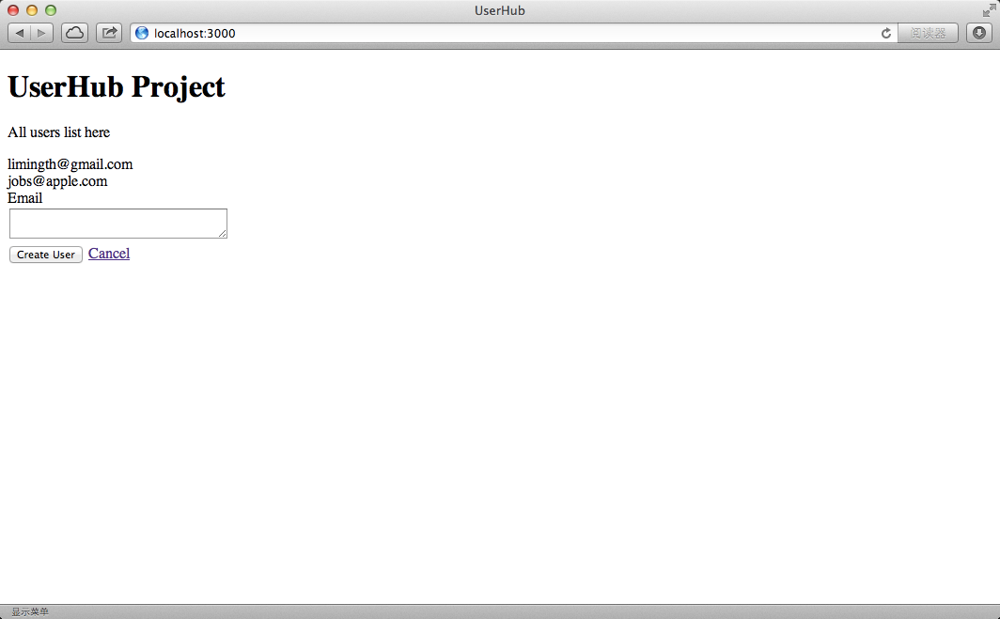
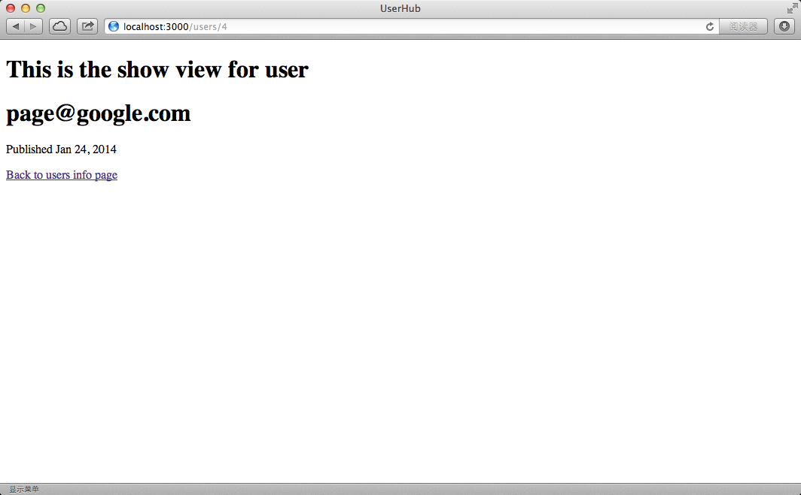
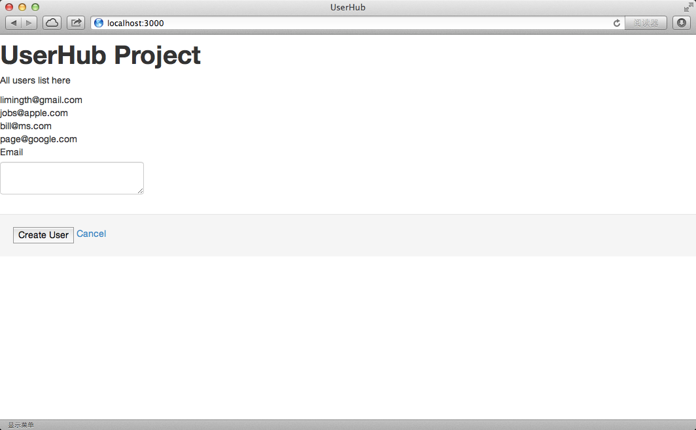
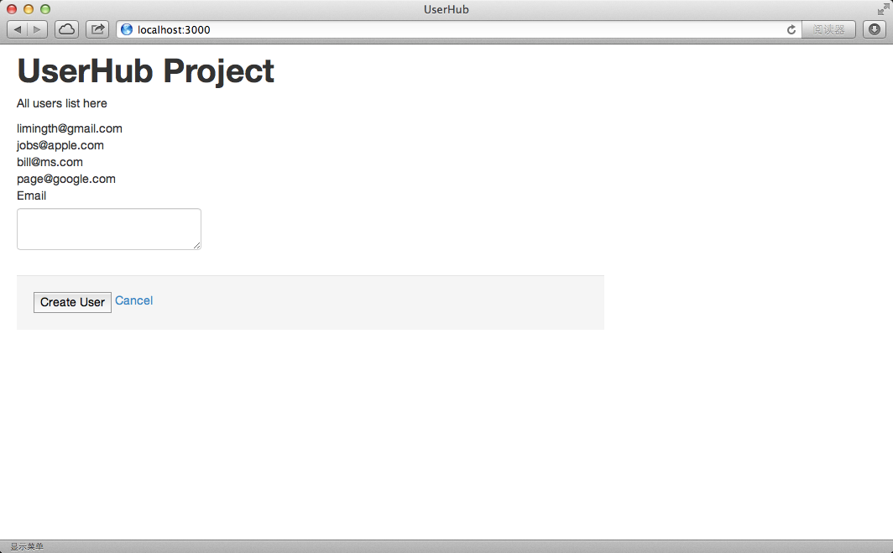
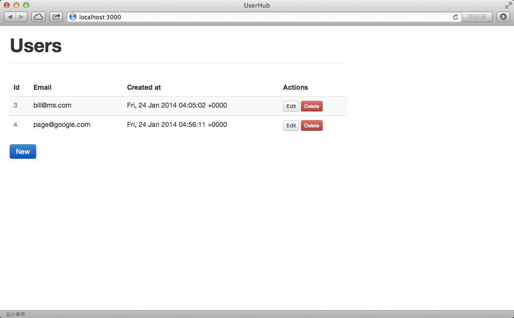
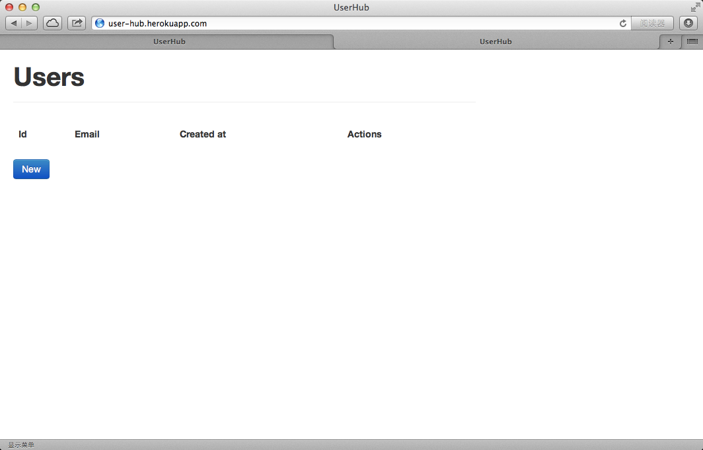

# Prj2 - UserHub 开发

step 1: 创建 user controller 来实现登录页面
------------------------------------------------------

### New a project
* rails new UserHub
* cd UserHub/

### Add users controller with index method
* rails g controller users index

		limingth@gmail ~/Github/UserHub$ rails g controller users index
		      create  app/controllers/users_controller.rb
		       route  get "users/index"
		      invoke  erb
		      create    app/views/users
		      create    app/views/users/index.html.erb
		      invoke  test_unit
		      create    test/controllers/users_controller_test.rb
		      invoke  helper
		      create    app/helpers/users_helper.rb
		      invoke    test_unit
		      create      test/helpers/users_helper_test.rb
		      invoke  assets
		      invoke    coffee
		      create      app/assets/javascripts/users.js.coffee
		      invoke    scss
		      create      app/assets/stylesheets/users.css.scss

### Modify route of root 
* vi config/routes.rb 
    - root 'users#index'
* chrome http://localhost:3000/

		Users#index

		Find me in app/views/users/index.html.erb

### Modify index.html.erb
* vi app/views/user/index.html.erb 

		1 <h1>UserHub Project</h1>
		2 
All users list here

                       
* chrome http://localhost:3000/
	- see the modified index page

### Git push 
* git init
* git status
* git add .
* git commit -a -m "Create UserHub project and Generate users controller"

step 2: 创建数据库 users 
------------------------------------------------------
### Change database from sqlite3 to pg
* vi Gemfile
	- comment: #gem 'sqlite3'
	- add: gem 'pg'
* bundle install

### Open psql from elephant icon
* start Postgres93 application and see in the console 'yourname=#' prompt
* psql=# \list to show all database existing
* think about a name for your database to store users like my_user_hub_dev
	- make sure this database name doesn't exist

### Modify database.yml from sqlite3 to pg
* vi config/database.yml

		development:
		  adapter: postgresql
		  database: my_user_hub_dev
		  pool: 5
		  timeout: 5000

		test:
		  adapter: postgresql
		  database: my_user_hub_test
		  pool: 5
		  timeout: 5000

		production:
		  adapter: postgresql
		  database: my_user_hub_production
		  pool: 5
		  timeout: 5000

### Create database in psql
* psql=# \list to make sure database is not created
* rake db:create
* psql=# \list to see if database is created

		my_user_hub_dev     | limingth | UTF8     | zh_CN.UTF-8 | zh_CN.UTF-8 | 
	 	my_user_hub_test    | limingth | UTF8     | zh_CN.UTF-8 | zh_CN.UTF-8 | 

* psql=# \c my_user_hub_dev;  to connect to database "my_user_hub_dev"

		You are now connected to database "my_user_hub_dev" as user "limingth".

* my_user_hub_dev=# \d to list tables in connected database "my_user_hub_dev" 

		No relations found.

### Create User model
* rails g model User

		limingth@gmail ~/Github/UserHub$ rails g model User
		      invoke  active_record
		      create    db/migrate/20140124034102_create_users.rb
		      create    app/models/user.rb
		      invoke    test_unit
		      create      test/models/user_test.rb
		      create      test/fixtures/users.yml

* rake db:migrate

		limingth@gmail ~/Github/UserHub$ rake db:migrate
		==  CreateUsers: migrating ====================================================
		-- create_table(:users)
		   -> 0.0248s
		==  CreateUsers: migrated (0.0251s) ===========================================

		limingth@gmail ~/Github/UserHub$ 

* my_user_hub_dev=# \d to make sure a table named users is created

		my_user_hub_dev=# \d
		                List of relations
		 Schema |       Name        |   Type   |  Owner   
		--------+-------------------+----------+----------
		 public | schema_migrations | table    | limingth
		 public | users             | table    | limingth
		 public | users_id_seq      | sequence | limingth
		(3 rows)

* my_user_hub_dev=# \d users to show the default Column in users table

		my_user_hub_dev=# \d users
		                                     Table "public.users"
		   Column   |            Type             |                     Modifiers                      
		------------+-----------------------------+----------------------------------------------------
		 id         | integer                     | not null default nextval('users_id_seq'::regclass)
		 created_at | timestamp without time zone | 
		 updated_at | timestamp without time zone | 
		Indexes:
		    "users_pkey" PRIMARY KEY, btree (id)

### Add email attribute to users table
* rails generate migration AddEmailToUsers email:string

		limingth@gmail ~/Github/UserHub$ rails generate migration AddEmailToUsers email:string 
		      invoke  active_record
		      create    db/migrate/20140124034216_add_email_to_users.rb

* my_user_hub_dev=# \d users to make sure no changes at all

* rake db:migrate (run this command Again)

		limingth@gmail ~/Github/UserHub$ rake db:migrate
		==  AddEmailToUsers: migrating ================================================
		-- add_column(:users, :email, :string)
		   -> 0.0032s
		==  AddEmailToUsers: migrated (0.0034s) =======================================

* my_user_hub_dev=# \d users to see a NEW Column email in users table

		my_user_hub_dev=# \d users
		                                     Table "public.users"
		   Column   |            Type             |                     Modifiers                      
		------------+-----------------------------+----------------------------------------------------
		 id         | integer                     | not null default nextval('users_id_seq'::regclass)
		 created_at | timestamp without time zone | 
		 updated_at | timestamp without time zone | 
		 email      | character varying(255)      | 
		Indexes:
		    "users_pkey" PRIMARY KEY, btree (id)

step 3: 添加数据库 users 的记录并通过 Rails Console 确认
------------------------------------------------------

### Add a first record into users table by hand
* my_user_hub_dev=# SELECT * from users; 

		my_user_hub_dev=# SELECT * from users; 
		 id | created_at | updated_at | email 
		----+------------+------------+-------
		(0 rows)

* my_user_hub_dev=# INSERT INTO users (email) VALUES('limingth@gmail.com');

		my_user_hub_dev=# INSERT INTO users (email) VALUES('limingth@gmail.com');
		INSERT 0 1

* my_user_hub_dev=# SELECT * from users; (see id:1 user created!)

		my_user_hub_dev=# SELECT * from users; 
		 id | created_at | updated_at |       email        
		----+------------+------------+--------------------
		  1 |            |            | limingth@gmail.com
		(1 row)

### Show all uses in rails console
* rails c

		limingth@gmail ~/Github/UserHub$ rails c
		Loading development environment (Rails 4.0.2)
		2.0.0-p247 :001 > User
		 => User(no database connection) 
		2.0.0-p247 :002 > User.all
		  User Load (3.4ms)  SELECT "users".* FROM "users"
		 => #<ActiveRecord::Relation [#<User id: 1, created_at: nil, updated_at: nil, email: "limingth@gmail.com">]> 
		2.0.0-p247 :003 > User.count
		   (1.6ms)  SELECT COUNT(*) FROM "users"
		 => 1 
		2.0.0-p247 :004 > User.first
		  User Load (1.8ms)  SELECT "users".* FROM "users" ORDER BY "users"."id" ASC LIMIT 1
		 => #<User id: 1, created_at: nil, updated_at: nil, email: "limingth@gmail.com"> 
		2.0.0-p247 :005 > User.last
		  User Load (1.4ms)  SELECT "users".* FROM "users" ORDER BY "users"."id" DESC LIMIT 1
		 => #<User id: 1, created_at: nil, updated_at: nil, email: "limingth@gmail.com"> 
		2.0.0-p247 :006 > User.first.email
		  User Load (1.1ms)  SELECT "users".* FROM "users" ORDER BY "users"."id" ASC LIMIT 1
		 => "limingth@gmail.com" 
		2.0.0-p247 :007 > User.first.id
		  User Load (1.8ms)  SELECT "users".* FROM "users" ORDER BY "users"."id" ASC LIMIT 1
		 => 1 
		2.0.0-p247 :008 > exit
		limingth@gmail ~/Github/UserHub$ 

step 4: 修改 user controller 并通过页面显示
------------------------------------------------------

### Modify controller
* vi app/controllers/users_controller.rb 

		2   def index
		3     @users = User.all
		4   end

* vi app/views/users/index.html.erb 

		4 <% @users.each do |u| %>
		5   <%= u.email %>  
		6 <% end %>

* restart rails server 
	- OR you will get an error message ActiveRecord::PendingMigrationError

* refresh localhost:3000
	- see that limingth@gmail.com is on the welcome page

* try to add a second record to users table by hand

		my_user_hub_dev=# INSERT INTO users (email) VALUES('jobs@apple.com');
		INSERT 0 1
		my_user_hub_dev=# select * from users;
		 id | created_at | updated_at |       email        
		----+------------+------------+--------------------
		  1 |            |            | limingth@gmail.com
		  2 |            |            | jobs@apple.com
		(2 rows)

* refresh localhost:3000 and see those 2 users are all shown

		UserHub Project

		All users list here

		limingth@gmail.com 
		jobs@apple.com 

step 5: 修改 user view 页面通过表单输入添加用户
------------------------------------------------------

### Modify view
* vi app/views/users/index.html.erb and add these to the bottom

		<%= form_for @user do |f| %>

		  

		    <%= f.label :email %>
		    

		      <%= f.text_area :email, cols: "30" %>
		    

		  

		  

		    <%= f.submit nil %>
		    <%= link_to 'Cancel', users_path %>
		  

		<% end %>

### Modify controller
* vi app/controllers/users_controller.rb 

		2   def index
		3     @users = User.all
		4     @user = User.new
		5   end

### Modify routes
* vi config/routes.rb

		2   get "user/index"
		3   resources :users	

### Refresh localhost:3000 
* see those 2 users are all shown

* fill the form and click Create user

		Unknown action
		The action 'create' could not be found for UsersController

### Add create method to controller
* vi app/controllers/users_controller.rb 

		  def create
		    @user = User.new(user_params)
		    if @user.save
		      redirect_to @user
		    else
		      render "new"
		    end 
		  end 

		private
		  def user_params
		    params.require(:user).permit(:name, :email)
		  end 

### Add show.html.erb 
* vi app/views/users/show.html.erb

		1 <h1>This is the show view for user</h1>
		2  
		3 

		4   <h1><%= @user.email %></h1>
		5   
Published <%= @user.created_at.strftime('%b %d, %Y') %>

		6   <a href="/users">Back to users info page</a>
		7   

		8 

* refresh localhost:3000 
	- see show user html

### Verify the database has been changed

		my_user_hub_dev=# select * from users;
		 id |         created_at         |         updated_at         |       email        
		----+----------------------------+----------------------------+--------------------
		  1 |                            |                            | limingth@gmail.com
		  2 |                            |                            | jobs@apple.com
		  3 | 2014-01-24 04:05:02.431573 | 2014-01-24 04:05:02.431573 | bill@ms.com
		(3 rows)

### Git push 
* git status
* git add .
* git commit -a -m "Add create user form and show user html"

step 6: 风格化 Styling with Bootstrap
------------------------------------------------------

### add some gems to Gemfile
* vi Gemfile

		  1 source 'https://rubygems.org'
		  2 
		  3 gem 'twitter-bootstrap-rails'
		  4 gem 'less-rails'
		  5 gem 'therubyracer'
		  6 

* bundle install

### twitter-bootstrap-rails install generator
* rails g bootstrap:install

		limingth@gmail ~/Github/UserHub$ rails g bootstrap:install
		      insert  app/assets/javascripts/application.js
		      create  app/assets/javascripts/bootstrap.js.coffee
		      create  app/assets/stylesheets/bootstrap_and_overrides.css.less
		      create  config/locales/en.bootstrap.yml
		        gsub  app/assets/stylesheets/application.css
		        gsub  app/assets/stylesheets/application.css

### stop rails server and restart it
* restart rails s 
	- see the page has no margin

### make all pages have margin 
* vi app/views/layouts/application.html.erb 

		 11 

		 12 <%= yield %>
		 13 

* refresh localhost:3000 
	- see the page has margin now

### new themed views for users
* rails g bootstrap:themed users -f

		limingth@gmail ~/Github/UserHub$ rails g bootstrap:themed users -f
		       force  app/views/users/index.html.erb
		      create  app/views/users/new.html.erb
		      create  app/views/users/edit.html.erb
		      create  app/views/users/_form.html.erb
		       force  app/views/users/show.html.erb
		limingth@gmail ~/Github/UserHub$ 

* refresh localhost:3000 
	- Object must be a Date, DateTime or Time object. nil given.

### delete the first 2 users in users table

		my_user_hub_dev=# select * from users;
		 id |         created_at         |         updated_at         |       email        
		----+----------------------------+----------------------------+--------------------
		  1 |                            |                            | limingth@gmail.com
		  2 |                            |                            | jobs@apple.com
		  3 | 2014-01-24 04:05:02.431573 | 2014-01-24 04:05:02.431573 | bill@ms.com
		  4 | 2014-01-24 04:56:11.381865 | 2014-01-24 04:56:11.381865 | page@google.com
		(4 rows)

		my_user_hub_dev=# DELETE FROM users where id = 1;
		DELETE 1
		my_user_hub_dev=# select * from users;
		 id |         created_at         |         updated_at         |      email      
		----+----------------------------+----------------------------+-----------------
		  2 |                            |                            | jobs@apple.com
		  3 | 2014-01-24 04:05:02.431573 | 2014-01-24 04:05:02.431573 | bill@ms.com
		  4 | 2014-01-24 04:56:11.381865 | 2014-01-24 04:56:11.381865 | page@google.com
		(3 rows)

		my_user_hub_dev=# DELETE FROM users where id = 2;
		DELETE 1
		my_user_hub_dev=# select * from users;
		 id |         created_at         |         updated_at         |      email      
		----+----------------------------+----------------------------+-----------------
		  3 | 2014-01-24 04:05:02.431573 | 2014-01-24 04:05:02.431573 | bill@ms.com
		  4 | 2014-01-24 04:56:11.381865 | 2014-01-24 04:56:11.381865 | page@google.com
		(2 rows)

* refresh localhost:3000 
	- Object must be a Date, DateTime or Time object. nil given.

step 7: 修改 edit 和删除 delete 记录
------------------------------------------------------

### Add edit method
* Click the edit button and there will be an error message

		The action 'edit' could not be found for UsersController

* vi app/controllers/users_controller.rb 

		 20   def edit
		 21     @user = User.find(params[:id])
		 22   end

* refresh localhost:3000 
	- see Edit User page

### Add update method

* Click the update button and there will be another erroro message

		The action 'update' could not be found for UsersController

* vi app/controllers/users_controller.rb 

		 24   def update
		 25     @user = User.find(params[:id])
		 26     if @user.update_attributes(user_params)
		 27       # Handle a successful update.
		 28     else
		 29       render 'edit'
		 30     end
		 31   end
		 32   

### Add new method
* Click the new button and there will be another erroro message

		ArgumentError in Users#new

		Showing /Users/limingth/Github/UserHub/app/views/users/_form.html.erb where line #1 raised:

		First argument in form cannot contain nil or be empty

* vi app/controllers/users_controller.rb 

		  7   def new
		  8     @user = User.new
		  9   end

### Add delete method
* Click the delete button and there will be another erroro message

		Unknown action
		The action 'destroy' could not be found for UsersController

* vi app/controllers/users_controller.rb 

		 38   def destroy
		 39     User.find(params[:id]).destroy
		 40     flash[:success] = "User deleted."
		 41     redirect_to users_url
		 42   end

### Check all routes
* rake routes

		limingth@gmail ~/Github/UserHub$ rake routes
		     Prefix Verb   URI Pattern               Controller#Action
		users_index GET    /users/index(.:format)    users#index
		      users GET    /users(.:format)          users#index
		            POST   /users(.:format)          users#create
		   new_user GET    /users/new(.:format)      users#new
		  edit_user GET    /users/:id/edit(.:format) users#edit
		       user GET    /users/:id(.:format)      users#show
		            PATCH  /users/:id(.:format)      users#update
		            PUT    /users/:id(.:format)      users#update
		            DELETE /users/:id(.:format)      users#destroy
		       root GET    /                         users#index

### git commit
* git status
* git add .
* git commit -a -m "Styling with Bootstrap"

### git push to github
* git branch --set-upstream-to=origin/master master
* git push --set-upstream origin master
* git pull
* git push

step 8: 部署到 Heroku 网站 Deploy on heroku
------------------------------------------------------

### git push heroku master
* heroku login

		limingth@gmail ~/Github/UserHub$ heroku login
		Enter your Heroku credentials.
		Email: limingth@gmail.com
		Password (typing will be hidden): 
		Authentication successful.
		limingth@gmail ~/Github/UserHub$ 

* heroku create user-hub

		limingth@gmail ~/Github/UserHub$ heroku create user-hub
		Creating user-hub... done, stack is cedar
		http://user-hub.herokuapp.com/ | git@heroku.com:user-hub.git
		Git remote heroku added

* git push heroku master

* heroku run rake db:setup

* visit http://user-hub.herokuapp.com

### Add some gem need by heroku
* vi Gemfile

		  3 ruby '2.0.0'
		  4 
		  5 gem 'rails_12factor'

* bundle install

### git push Again
* git commit -a -m "add rails_12factor"
* git push
* git push heroku master

### Enjoy the project 2
* refresh http://user-hub.herokuapp.com
	- see UserHub project hosted on heroku

step 9: 闪烁消息 Flash Message
------------------------------------------------------

### Add Flash message in controller
* vi app/controllers/users_controller.rb 

		  2   def index
		  3     @users = User.all
		  4     flash[:success] = "User all retrieved."
		  5     @user = User.new
		  6   end

### Show Flash message in view
* vi app/views/layouts/application.html.erb

		<body>

		

		  

		        

		        <%= yield %>
		        

		        

		            <% flash.each do |name, msg| %>
		              <%= content_tag :div, msg, id: "flash_#{name}" %>
		            <% end %> 
		        
  
		  
    
		

		</body>

### Add all method with a flash message
* vi app/controllers/users_controller.rb 

		limingth@gmail ~/Github/UserHub$ cat app/controllers/users_controller.rb 
		class UsersController < ApplicationController
		  def index
		    @users = User.all
		    flash[:success] = "User all retrieved."
		    @user = User.new
		  end

		  def new
		    @user = User.new
		    flash[:success] = "User new."
		  end

		  def create
		    @user = User.new(user_params)
		    if @user.save
		      flash[:success] = "User create."
		      redirect_to @user
		    else
		      render "new"
		    end 
		  end

		  def show
		    @user = User.find(params[:id])
		    flash[:success] = "User show."
		  end

		  def edit
		    @user = User.find(params[:id])
		    flash[:success] = "User edit."
		  end

		  def update
		    @user = User.find(params[:id])
		    if @user.update_attributes(user_params)
		      # Handle a successful update.
		      flash[:success] = "User update."
		      redirect_to @user
		    else
		      render 'edit'
		    end
		  end

		  def destroy
		    User.find(params[:id]).destroy
		    flash[:success] = "User deleted."
		    redirect_to users_url
		  end

		private
		  def user_params
		    params.require(:user).permit(:name, :email)
		  end
		end

* refresh to see if flash message shows

step 10: 邮件发送 Sending Email
------------------------------------------------------

* [How to Send a mail using Gmail account with Rails3 ActionMailer and SMTP](http://thasulinux.wordpress.com/2011/04/20/how-to-send-a-mail-using-gmail-account-with-rails3-actionmailer-and-smtp/)

### Create setup_mail.rb
* vi config/initializers/setup_mail.rb

	ActionMailer::Base.smtp_settings = {  
	      :address              => "smtp.gmail.com",  
	      :port                 => 587,  
	      :domain               => "gmail.com",  
	     :user_name            => "thasuresh", #Your user name
	      :password             => "actionmailer", # Your password
	      :authentication       => "plain",  
	      :enable_starttls_auto => true  
	   }

### rails g mailer
* rails generate mailer user_mailer

### Modify user_mailer.rb
* vi app/mailer/user_mailer.rb

	class UserMailer < ActionMailer::Base
		default :from => "thasuresh@gmail.com"
		 
		def registration_confirmation(user)
			mail(:to => user.email, :subject => "Registered")
		end
	end

### Create registration_confirmation.html.erb
* vi app/views/user_mailer/registration_confirmation.html.erb

	Thank you for registering!

### Modify users_controller.rb
* vi app/controllers/users_controller.rb  

	UserMailer.registration_confirmation(@user).deliver  

